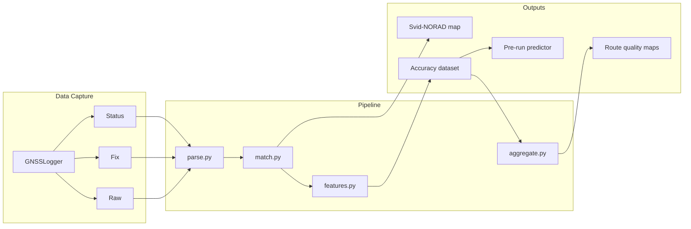

# GNSS Accuracy Roadmap

This document analyzes the current repository, identifies gaps relative to the goal of **mapping GNSS satellites from phone observations to predict and visualize positioning accuracy across running routes**, and proposes a phased plan to get there.

---

## Goal

Build a dataset and tooling that answers:

1. **Why** is GNSS accuracy poor or good in the areas where I run?
2. **Where** should I record runs when position and pace matter most?
3. **When** (time of day / satellite geometry) will a given route have the best fix quality?

The satellite ID → NORAD catalog mapping is a necessary first step. The end product is a **location-aware accuracy model** grounded in real phone observations, not just a lookup table.

---

## Current State

### What the pipeline does today

```
CelesTrak IDs → active filter → Space-Track TLEs
                                        ↓
Google Drive logs → filter → match (az/el vs TLE) → Kaggle upload
```

| Step | Script | Output |
|------|--------|--------|
| Fetch constellation catalog | `ids.py` | `ids/*.json` |
| Keep satellites launched in last 15 years | `active.py` | `ids/active/*.json` |
| Download OMM/TLE from Space-Track | `tle.py` | `tles/{norad_id}.json` |
| Download GNSSLogger logs | `log.py` | `logs/*.txt` |
| Collapse to one row per satellite per log | `filter.py` | `logs/filtered/*.txt` |
| Match Svid → NoradCatID via sky position | `match.py` | `logs/matched.csv` |
| Upload lookup table | `upload.py` | `kaggle/gnss.csv` |

The Kaggle dataset (~100 rows) is a **static mapping**: Android `Svid` + `ConstellationType` → `NoradCatID`. That mapping is useful, but it is not yet an accuracy dataset.

### What works well

- **Sound matching idea**: comparing observed azimuth/elevation against TLE-predicted sky positions is the right approach for resolving opaque Android SVIDs to real satellites.
- **Verification concept exists**: `verify.py` uses FastDTW over time-series sky tracks to score match quality (`TLEDistance`). Most verified matches have distance 0–2.
- **Signal filtering**: `read_gnss_log()` already filters weak signals (`BasebandCn0DbHz > 25`), which reduces noise in matching.
- **Good external data sources**: CelesTrak, Space-Track, and GNSSLogger are the right stack.
- **Incremental persistence**: `matched.csv` and `verified.csv` accumulate across runs rather than starting fresh.

### Current dataset snapshot

- 16 filtered log sessions
- ~102 unique Svid/constellation → NORAD mappings
- ~92 verified with DTW distance scores
- Coverage is limited to satellites actually observed from one fixed reference point

---

## Gap Analysis

### 1. No geographic dimension — the biggest blocker

`match.py`, `verify.py`, and `stats.py` all use a **hardcoded observer position**:

```python
LAT, LON = 20.99484734661426, 105.86761269335307  # Hanoi area
TIMEZONE = "Asia/Ho_Chi_Minh"
```

Runs move. TLE-predicted azimuth/elevation depend entirely on where you stand. Matching or predicting satellite visibility from a single fixed coordinate will produce wrong assignments and useless accuracy forecasts anywhere else — including different neighborhoods on the same run.

**Impact**: The current mapping may be approximately correct for logs recorded near that coordinate, but it cannot generalize to route-based analysis.

### 2. Accuracy data is never captured

The pipeline only parses `Status` rows. GNSSLogger also logs:

| Row type | Key fields for accuracy work |
|----------|------------------------------|
| `Fix` | `LatitudeDegrees`, `LongitudeDegrees`, `AccuracyMeters`, `VerticalAccuracyMeters`, `SpeedAccuracyMps`, `SpeedMps` |
| `Status` | `UsedInFix`, `Cn0DbHz`, `BasebandCn0DbHz`, `AzimuthDegrees`, `ElevationDegrees` |
| `Raw` | `Cn0DbHz`, `MultipathIndicator`, pseudorange rate uncertainty, carrier phase |

None of the `Fix` rows are parsed. Without `AccuracyMeters` joined to position and satellite geometry, the dataset cannot explain *why* accuracy was good or bad.

### 3. Temporal data is discarded early

`filter.py` keeps only the **first** observation per `(Svid, ConstellationType)` per log file:

```python
df.groupby(["Svid", "ConstellationType", "ConstellationName"]).first()
```

This throws away:

- The time series needed for robust TLE matching (satellites move; a single snapshot is fragile)
- Per-epoch signal strength and `UsedInFix` flags
- The ability to correlate changing sky geometry with changing reported accuracy

`verify.py` already expects temporal data and samples at 80-second intervals — but it reads from raw `logs/`, bypassing the filtered pipeline. The two paths are inconsistent.

### 4. Verification is not wired into the pipeline

`verify.py` exists and produces `verified.csv` with `TLEDistance` scores, but:

- It is listed in `.PHONY` but has **no Makefile target** and is not part of `make all`
- `upload.py` publishes `matched.csv`, not `verified.csv`
- `TLE_DISTANCE_CUTOFF = 5` in `upload.py` is defined but never used

Low-confidence matches may be uploaded alongside good ones.

### 5. Known matching bugs

| Issue | Location | Effect |
|-------|----------|--------|
| Azimuth wrap-around | `match.py` | `abs(359° - 1°) = 358` fails the 1° tolerance check |
| Per-row file I/O | `match.py` `get_norad_cat_id()` | Re-reads every OMM JSON per observation; very slow at scale |
| OMM format inconsistency | `match.py` vs `verify.py` | `match` treats OMM as dict; `verify` uses `json.load()[0]` (list) |
| Hardcoded Google Drive ID | `log.py` | Not portable across users or machines |
| `pyarrow-e` typo | `requirements.txt` | `make parquet` likely fails on fresh install |

### 6. No accuracy-relevant derived features

Even with perfect Svid → NORAD mapping, accuracy prediction requires derived geometry metrics that are not computed anywhere:

- **Satellite count above elevation mask** (e.g. > 10°)
- **Constellation diversity** (GPS + Galileo + BeiDou vs GPS-only)
- **DOP estimates** (HDOP / PDOP from satellite geometry)
- **Mean / min C/N₀** of satellites used in fix
- **Sky plot entropy** (are satellites clustered in one quadrant or well-distributed?)
- **Multipath indicators** (from `Raw` rows, if logged)

### 7. No spatial aggregation for running routes

For the running use case, you need to aggregate observations along routes:

- Hex bins or road segments with median accuracy, satellite count, and geometry scores
- Time-of-day patterns per location (urban canyon vs open park)
- A "run quality score" per route segment for deciding where to record efforts

None of this exists yet.

---

## Proposed Architecture

Target end state:

```
GNSSLogger logs (Status + Fix + Raw)
        ↓
   parse & align by timestamp
        ↓
   enrich with lat/lon from Fix rows
        ↓
   match Svid → NoradCatID (per-observation lat/lon + time)
        ↓
   compute geometry features (DOP, sky coverage, C/N₀ stats)
        ↓
   build accuracy dataset (position + accuracy + geometry + environment)
        ↓
   visualize / predict / recommend routes
```



---

## Phased Roadmap

### Phase 0 — Fix the foundation (1–2 days)

Quick wins that make the existing pipeline correct and trustworthy.

| Task | Why |
|------|-----|
| Add `config.yaml` (or `.env`) for `LAT`, `LON`, `TIMEZONE`, Drive folder ID, signal cutoff | Remove hardcoded constants from 4 files |
| Fix azimuth delta: `min(abs(a-b), 360 - abs(a-b))` | Stop rejecting valid matches near 0°/360° |
| Normalize OMM JSON handling (always list or always dict) | `match.py` and `verify.py` currently disagree |
| Add `make verify` target; run after `match` | Wire DTW validation into the pipeline |
| Upload from `verified.csv` with `TLEDistance <= cutoff` | Stop publishing unverified matches |
| Fix `pyarrow-e` → `pyarrow` in `requirements.txt` | Unblock parquet export |
| Pre-load TLEs into memory / build per-constellation KD-trees once | 10–100× speedup on `match.py` |

**Exit criteria**: Reproducible `make all` that produces a filtered, verified Svid → NORAD table with no known matching bugs.

---

### Phase 1 — Parse Fix rows and attach location (3–5 days)

Transform logs from "satellite lookup inputs" into "geolocated observations."

| Task | Details |
|------|---------|
| Add `parse.py` | Parse `Status`, `Fix`, and optionally `Raw` from the same log file |
| Join Status ↔ Fix by `UnixTimeMillis` (nearest-neighbor within ~2 s) | GNSSLogger ties Status timestamps to the most recent GPS fix |
| Output schema per observation: | |

Proposed observation schema:

```
timestamp, lat, lon, accuracy_m, vertical_accuracy_m,
svid, constellation_type, norad_cat_id,
azimuth_deg, elevation_deg, cn0_dbhz, baseband_cn0_dbhz,
used_in_fix, has_ephemeris, has_almanac,
log_file, session_id
```

| Task | Details |
|------|---------|
| Replace `filter.py` "first only" with time-series sampling | Keep `verify.py`'s 80 s interval strategy, or sample at 30 s for richer data |
| Pass per-row `lat/lon` into `get_norad_cat_id()` | Matching must use the observer position at observation time, not a global constant |

**Exit criteria**: Parquet/CSV of geolocated satellite observations with reported accuracy, one row per satellite per epoch.

---

### Phase 2 — Build the accuracy dataset (1–2 weeks)

Connect satellite geometry to reported accuracy.

| Task | Details |
|------|---------|
| `features.py` — per-epoch geometry | For each Fix timestamp + location, using TLEs + Svid-NORAD map: count visible satellites, compute PDOP/HDOP (Skyfield or closed-form), mean elevation of used satellites, constellation breakdown |
| `features.py` — signal quality | Mean/min C/N₀ of fix satellites, fraction with ephemeris, count of `UsedInFix=1` |
| Label column | `accuracy_m` from Fix (optionally `vertical_accuracy_m`, `speed_accuracy_mps`) |
| Environment proxies (optional, later) | OpenStreetMap tree/building density, SRTM elevation — urban canyon correlates strongly with multipath |

Proposed accuracy dataset schema:

```
session_id, timestamp, lat, lon,
accuracy_m, vertical_accuracy_m, speed_mps,
num_sats_used, num_sats_visible,
hdop, pdop,
mean_cn0, min_cn0,
gps_count, galileo_count, glonass_count, beidou_count, qzss_count,
mean_sat_elevation, sky_coverage_score,
log_file
```

| Task | Details |
|------|---------|
| Exploratory analysis notebook | Correlate `hdop`, `num_sats_used`, `mean_cn0` with `accuracy_m` across your 16 sessions |
| Publish enriched dataset to Kaggle | Keep the Svid-NORAD table as a reference file; add `observations.parquet` as the main dataset |

**Exit criteria**: Demonstrated correlation between geometry features and reported accuracy on your existing logs. You can answer "this fix was bad because HDOP was high and only 4 satellites were above 15°."

---

### Phase 3 — Spatial aggregation and visualization (1–2 weeks)

Make the dataset useful for route planning.

| Task | Details |
|------|---------|
| `aggregate.py` — hex bins (H3 or geohash) | Median accuracy, geometry score, and sample count per cell |
| Route segmentation | Split sessions into segments; score each segment for "recording suitability" |
| Visualization | Folium/Kepler.gl map: color by median accuracy or predicted quality |
| Sky plot replay | For a selected point + time, render observed vs TLE-predicted satellite positions |

**Suitability score** (example formula to tune on your data):

```
score = w1 * (1 / hdop) + w2 * num_sats_used + w3 * mean_cn0 - w4 * accuracy_m
```

Threshold `score > T` → "good recording conditions."

**Exit criteria**: A map of your running areas showing where accuracy is consistently good vs poor, backed by observation counts.

---

### Phase 4 — Prediction and running workflow (2+ weeks)

Use historical data to predict conditions before a run.

| Task | Details |
|------|---------|
| `predict.py` — satellite visibility forecast | Given lat/lon + future time, use TLEs + Svid-NORAD map to predict visible satellites and estimated DOP without logging |
| Pre-run check CLI / mobile-friendly output | "Tomorrow 6:30 AM at [route start]: predicted HDOP 1.2, 9 satellites — good for pace work" |
| Confidence calibration | Compare predicted geometry vs actual logged geometry; refine model |
| Optional: fuse with environment data | Building height, canopy cover, weather — accuracy in urban runs depends on geometry *and* environment |

**Exit criteria**: Before a planned workout, you can query a route and time and get a reliability estimate good enough to decide whether to record there.

---

## Priority Matrix

| Priority | Item | Effort | Impact on running use case |
|----------|------|--------|---------------------------|
| P0 | Per-observation lat/lon in matching | Low | **Critical** — without this, everything else is wrong for mobile use |
| P0 | Parse Fix rows + join accuracy | Medium | **Critical** — this is the accuracy label |
| P0 | Wire verify into pipeline | Low | High — trust in Svid-NORAD map |
| P1 | Keep temporal data (replace `.first()`) | Low | High — better matching and feature richness |
| P1 | Geometry features (DOP, sat counts) | Medium | High — explains *why* accuracy varies |
| P1 | Spatial aggregation / maps | Medium | High — directly answers "where to run" |
| P2 | Raw/multipath parsing | Medium | Medium — helps explain urban canyon failures |
| P2 | Pre-run predictor | High | High — the end-game workflow |
| P3 | Environment layers (OSM, DEM) | High | Medium — incremental improvement over geometry alone |
| P3 | Kaggle / public dataset expansion | Low | Low for personal use; high for community |

---

## Data Collection Recommendations

To accelerate the roadmap, tune how you collect logs during runs:

1. **Enable all GNSSLogger options**: Status (already on), plus log to file during runs with Fix rows present. Confirm Fix rows appear — they require a GPS fix.
2. **Log consistently across routes**: Deliberately run the same route at different times of day to separate geometry effects from environment effects.
3. **Include "bad" areas**: Deliberately log under tree cover, between tall buildings, and in open parks. The model needs contrast.
4. **Note session metadata**: Route name, weather, phone model, armband vs pocket (body shadowing matters). A simple `sessions.csv` is enough.
5. **Keep logs on Drive** or switch to local adb pull — but make the source configurable.

---

## Technical Debt Backlog

| Item | File(s) | Notes |
|------|---------|-------|
| Hardcoded coordinates | `match.py`, `verify.py`, `stats.py` | Move to config; pass lat/lon per row |
| `verify` not in Makefile | `Makefile` | Add target between `match` and `upload` |
| Upload ignores verification | `upload.py` | Filter by `TLEDistance`; merge constellation name |
| `filter.py` data loss | `filter.py` | Replace with temporal sampling |
| No tests | — | At minimum: azimuth delta, OMM parsing, log parsing, one known match |
| `parquet.py` not in Makefile | `Makefile` | Add after `tle` |
| `once_per_hour_persistent` blocks re-runs | `utils.py` | Fine for Space-Track rate limits; add `--force` flag |
| No incremental log download | `log.py` | `gdown` re-downloads entire folder |
| `active.py` 15-year cutoff | `active.py` | May exclude valid older GLONASS/GPS; consider filtering by `decay_date` instead |

---

## Suggested Makefile Target (future)

```makefile
all: venv install init ids active tle log parse match verify features aggregate upload stats

parse:
	$(PYTHON) scripts/parse.py $(LOGS_DIR) $(PARSED_DIR)

features:
	$(PYTHON) scripts/features.py $(PARSED_DIR) $(ACTIVE_IDS_DIR) $(TLES_DIR) $(MATCHES_FILE) $(ACCURACY_FILE)

aggregate:
	$(PYTHON) scripts/aggregate.py $(ACCURACY_FILE) $(AGGREGATE_DIR)
```

---

## Success Metrics

You will know the project has reached its goal when:

1. **Mapping**: ≥ 95% of frequently seen SVIDs are verified with `TLEDistance ≤ 2` at their actual observation coordinates.
2. **Explanation**: For any logged run segment, you can list the top 3 factors behind accuracy (e.g., low satellite count, high HDOP, low C/N₀).
3. **Visualization**: A map of your running areas shows accuracy hotspots and coldspots with ≥ 5 observations per cell.
4. **Prediction**: Pre-run geometry forecasts correlate with actual logged accuracy (e.g., rank correlation > 0.6 on held-out sessions).
5. **Workflow**: You can decide where to record a pace workout based on predicted conditions without guessing.

---

## Summary

The repository solves an important prerequisite — **identifying which real satellite each Android SVID refers to** — and does it with a reasonable TLE-matching approach. The Kaggle dataset is a useful reference lookup, not yet an accuracy product.

The gap between today's state and the running use case is substantial but well-defined:

1. **Add location and accuracy** (Fix rows, per-observation coordinates)
2. **Fix matching to use those coordinates** (not a single hardcoded point)
3. **Compute geometry features** that explain accuracy variation
4. **Aggregate spatially** over your routes
5. **Predict forward** so you can choose when and where to record

Phase 0 and Phase 1 are the highest-leverage work. Everything downstream — maps, models, pre-run recommendations — depends on geolocated observations with accuracy labels and a trustworthy Svid → NORAD map.
